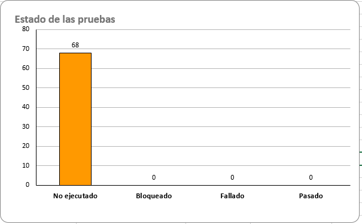
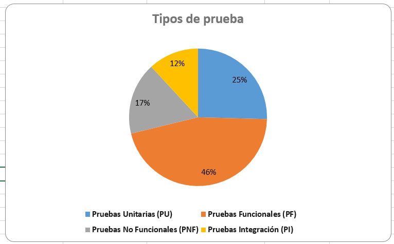
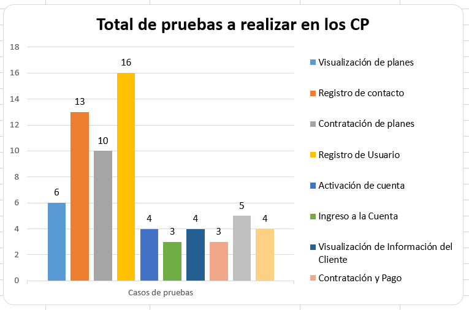

# PruebaTecnica-QUIPU

## Entregables

1. [Definición y conceptos base sobre el proceso de calidad.](Definición-y-conceptos-base-sobre-el-proceso-de-calidad)
2. [Reconocimiento y definición de tipos de pruebas.](Reconocimiento-y-definición-de-tipos-de-pruebas)
3. [Diseño de Casos de Prueba.](Diseño-de-Casos-de-Prueba)
4. [Analisis de servicios web.](Analisis-de-servicios-web)
5. [Automatización de pruebas.](Automatización-de-pruebas)
6. [Manejo de sentencias SQL.](Manejo-de-sentencias-SQL)

## 3. [Diseño de Casos de Prueba.](Diseño-de-Casos-de-Prueba)

Esta es una breve [explicación del diseño de prueba](Diseño-de-Casos-de-Prueba/ExplicaciónDiseñoPrueba.mp4)

El diseño del caso de prueba realizado muestra el estado de ejecución actual de cada tipo de prueba y el número total de casos de prueba diseñados para cada funcionalidad del sistema. Aquí está el resumen:

## Resultado de las Pruebas:
- No Ejecutado: 68 casos de prueba.
- Bloqueado: 0 casos de prueba.
- Fallado: 0 casos de prueba.
- Pasado: 0 casos de prueba.

## Desglose por Tipo de Pruebas y Porcentajes:
- Pruebas Unitarias (PU): 15 casos de prueba (22%).
- Pruebas Funcionales (PF): 27 casos de prueba (40%).
- Pruebas No Funcionales (PNF): 10 casos de prueba (15%).
- Pruebas Integración (PI): 7 casos de prueba (10%).

## Desglose por Funcionalidad:
- Visualización de Planes: 6 prueba.
- Registro de Contacto: 13 prueba.
- Contratación de Planes: 10 prueba.
- Registro de Usuario: 16 prueba.
- Activación de Cuenta: 4 prueba.
- Ingreso a la Cuenta: 3 prueba.
- Visualización de Información del Cliente: 4 prueba.
- Contratación y Pago: 3 prueba.
- Proceso de Pago y Notificación: 5 prueba.
- Compatibilidad de Dispositivos: 4 prueba.

## Total de casos de prueba: 23.
- Total de Pruebas: 68 

Este análisis proporciona una visión general del estado de las pruebas en términos de cobertura y ejecución. Los resultados muestran que aún no se han ejecutado las pruebas, pero se han diseñado una variedad de casos de prueba para cubrir diferentes aspectos del sistema. Se espera que el tester aplique las pruebas en base a su experiencia y agregue nuevos casos de prueba según sea necesario para mejorar la estabilidad del proyecto y futuros proyectos.

## 5. [Automatización de pruebas.](Automatización-de-pruebas)
    
Quisiera informarles que, lamentablemente, no pude completar la tarea número 3 de la prueba técnica de Automatización de Pruebas debido a restricciones de seguridad implementadas por Google. Al intentar ejecutar el script de Selenium con Python para automatizar el proceso de envío de correo electrónico, me encontré con limitaciones que impidieron su realización exitosa.

Tras investigar más a fondo, descubrí que estas limitaciones están relacionadas con políticas de seguridad actualizadas por parte de Google, las cuales restringen ciertas acciones automatizadas en su plataforma. Aunque he intentado adaptar el script para cumplir con estas políticas, no he tenido éxito hasta el momento.

Sin embargo, [encontrarán dos scripts](Automatización-de-pruebas/AutomatizaciónPruebaQUIPU/) que llegan hasta el punto donde Google permite el acceso. Lamentablemente, esto limita la capacidad de completar el proceso de envío de correo electrónico.

Dado este inconveniente, sugiero considerar cambiar este punto por otro sistema o proceso que pueda ser implementado exitosamente. Agradezco su comprensión y quedo atento a cualquier instrucción adicional que puedan proporcionar.
    
